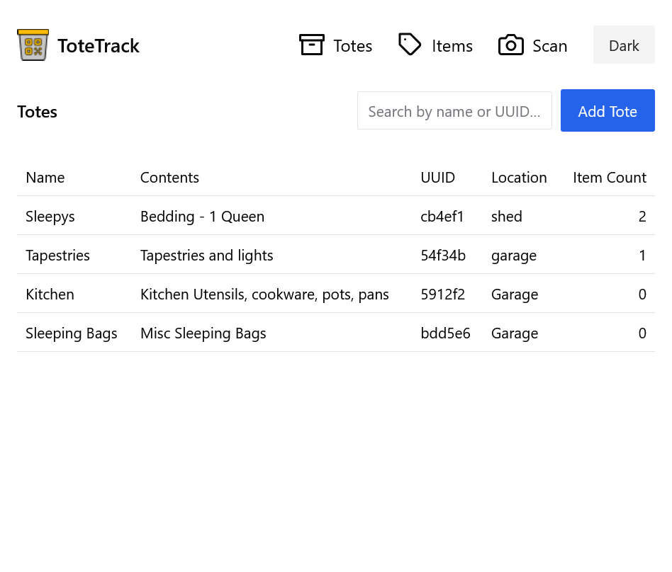
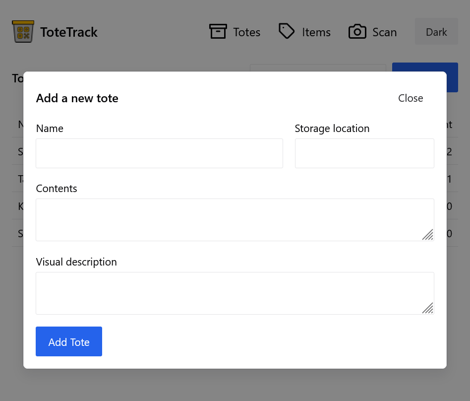
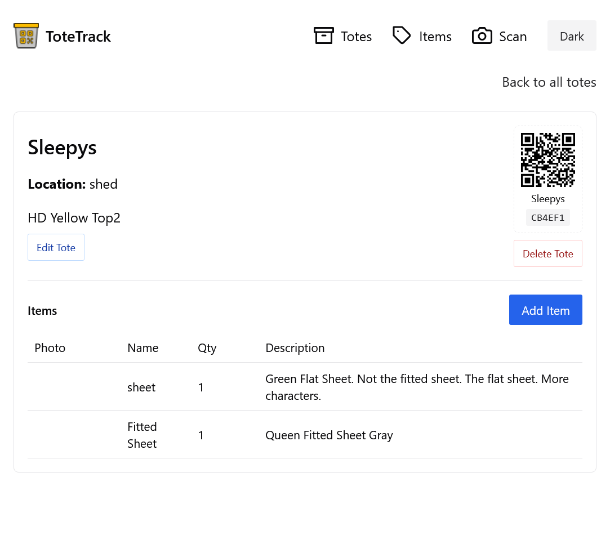
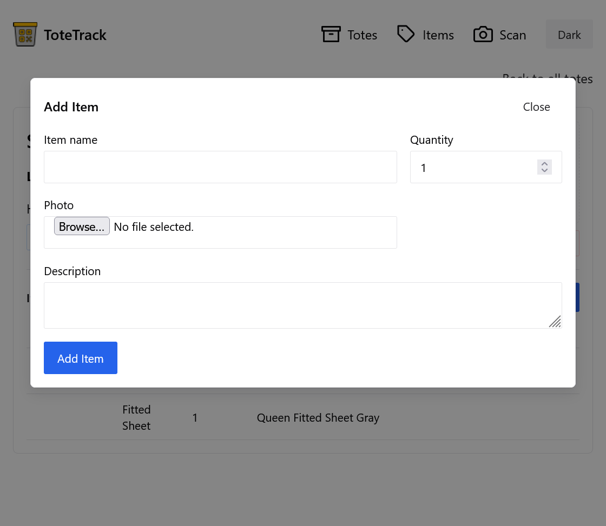

# ToteTrack

Inventory & tote tracking with fast item capture, QR labels, multi-account isolation, and mobile-friendly scanning.


## Overview
ToteTrack lets you create "totes" (containers) and add items to each tote so you can search, scan, and know where everything lives. Each tote gets a QR code for printing and attaching to the tote; scanning jumps straight to the tote detail view. Great for garage / maker space / prop room / move preparation organization.

### New (Sidebar & Profile Modal)
Authenticated users now have a responsive navigation sidebar (desktop) / hamburger drawer (mobile) containing:
- Totes (/)
- Items (/items)
- Users (/users) when the account is a superuser.

The top bar now only includes utility actions: color mode toggle, CSV export, Profile (opens modal), and Logout. The Profile modal lets you update your full name and password (email is read-only). Changes refresh the in-memory user context automatically.

### Core Features
- Isolated "accounts" with a dedicated superuser and scoped sub-accounts
- Create / delete totes with name, location, description, arbitrary metadata JSON
- Add/update/remove items (name, quantity, description, image upload)
- Image storage on disk served via `/media/*`
- Fast search across all totes within the signed-in account
- QR label component for easy printing
- Mobile camera QR scanning (secure context aware)

### Stack
- Frontend: React 18 + Vite + TypeScript + Chakra UI
- Backend: FastAPI, SQLAlchemy 2.x, Pydantic v2, SQLite (file DB shipped as `totes.db`)
- Dev Environment: VS Code Dev Container (Python + Node + uv package manager)

## Screenshots
Below are a few screenshots from the current UI. Images are stored under `images/` in this repo.

<p>
	
	
</p>
<p>
	
	
</p>

---
## Quick Start (Dev)
Follow these 4 steps (requested flow):

1. Build / open the Dev Container
	- In VS Code: Command Palette > "Dev Containers: Rebuild and Reopen in Container" (or initial prompt when opening repo)
	- CLI (optional):
	  ```bash
	  devcontainer up --workspace-folder .
	  ```
	Post-create hooks auto install frontend deps (`npm install`) and backend deps (`uv sync`).

2. Start the frontend
	```bash
	cd frontend/
	npm run dev -- --host 0.0.0.0   # exposes on :5173 for LAN & container
	```
	Visit: http://localhost:5173 (or https variant below). Add `VITE_HTTPS=1` for a self‑signed cert.

3. Launch backend (FastAPI) in debug / auto-reload
	```bash
	cd backend/
	rm -f totes.db                # schema changes? purge instead of migrate
	uv run uvicorn app.main:app --reload --host 0.0.0.0 --port 8000
	```
	Docs: http://localhost:8000/docs  |  OpenAPI JSON: http://localhost:8000/openapi.json

4. Launch a browser debugger (Chrome or Firefox)
	- In VS Code: Run & Debug panel → choose "Chrome: Frontend" or "Firefox: Frontend" (see provided `.vscode/launch.json`).
	- Or manually open your browser at the frontend URL and use devtools.

You now have:
- Frontend: 5173
- Backend API: 8000

---
## API Snapshot
| Method | Path | Description |
|--------|------|-------------|
| POST | /accounts | Bootstrap a new account + superuser |
| POST | /auth/token | Login (JWT) |
| GET | /users | List account users (superuser only) |
| POST | /users | Create sub-account (superuser only) |
| POST | /totes | Create tote (scoped to current account) |
| GET | /totes | List totes for current account |
| GET | /totes/{id} | Get tote detail (account-scoped) |
| DELETE | /totes/{id} | Delete tote |
| POST | /totes/{id}/items | Create item (multipart form, optional image) |
| GET | /items | List all items for current account |
| GET | /totes/{id}/items | Items in one tote |
| PUT | /items/{item_id} | Update item (fields + optional new image) |
| DELETE | /items/{item_id} | Delete item |

Image URLs in responses (if present) are relative (e.g. `/media/filename.jpg`).

> **Account model**: each account is created via `/accounts` and automatically receives exactly one superuser. That superuser can invite additional sub-accounts but cannot create a second superuser; the platform enforces one-superuser-per-account to keep ownership clear. All totes, locations, and items are scoped to the authenticated account ID.

### Example Tote (response)
```json
{
  "id": "6c4d4c8c-a9c4-4b6e-9a1e-7d5d5d7e1f09",
  "name": "Electronics",
  "location": "Shelf A3",
  "description": "Cables and adapters",
  "metadata_json": null,
  "items": []
}
```

---
## Import/Export (CSV Format)

ToteTrack supports bulk data import and export via ZIP files containing CSV data. This is useful for:
- Backing up your inventory data
- Migrating between instances
- Bulk importing existing inventories
- Data analysis and reporting

### Export Process
1. Click the "Export Data" button in the top navigation
2. Downloads a ZIP file containing up to 4 CSV files:
   - `locations.csv` - All locations in your account
   - `totes.csv` - All totes with location relationships
   - `items.csv` - All items with tote relationships and checkout status
   - `users.csv` - All users (admin accounts only)

### Import Process
1. Prepare your CSV files following the format specifications below
2. Package them into a ZIP file (any or all of the 4 files)
3. Use the import functionality to upload and process the data
4. Review the import report for created items and any warnings

### CSV Format Specifications

All CSV files must follow RFC 4180 standards with UTF-8 encoding. Fields containing commas, quotes, or newlines should be quoted, with internal quotes escaped as `""`.

#### `locations.csv`
```csv
id,name,description
loc-001,Warehouse A,Main storage facility
loc-002,Office,Administrative area
```
- **id**: UUID (can be existing or new)
- **name**: Unique location name (required)
- **description**: Optional description

#### `totes.csv`
```csv
id,name,description,location,location_id,metadata_json,items_count
tote-001,Electronics Box,Computer parts,Warehouse A,loc-001,"{}",5
tote-002,Office Supplies,,Office,loc-002,"{}",12
```
- **id**: UUID for mapping to items (temporary during import)
- **name**: Tote name (can be empty for unnamed totes)
- **description**: Optional description
- **location**: Location name (legacy, for backward compatibility)
- **location_id**: Preferred UUID reference to location
- **metadata_json**: Optional JSON metadata as string
- **items_count**: Informational count (calculated during export)

#### `items.csv`
```csv
id,name,description,quantity,tote_id,image_url,is_checked_out,checked_out_at,checked_out_by_id,checked_out_by_email,checked_out_by_name
item-001,Laptop,Dell Latitude 5520,1,tote-001,/media/laptop.jpg,true,2023-10-13T14:30:00Z,user-001,john@example.com,John Doe
item-002,USB Cable,USB-C to USB-A,5,tote-001,,false,,,,,
```
- **id**: UUID identifier
- **name**: Item name (required)
- **description**: Optional description
- **quantity**: Number of items (defaults to 1)
- **tote_id**: UUID of parent tote (optional)
- **image_url**: Relative path like `/media/filename.jpg`
- **is_checked_out**: Boolean checkout status
- **checked_out_at**: ISO datetime string (optional)
- **checked_out_by_id**: User UUID who checked out (optional)
- **checked_out_by_email**: User email (informational)
- **checked_out_by_name**: User full name (informational)

#### `users.csv` (Admin Only)
```csv
id,email,full_name,is_active,is_superuser,account_id,created_at,updated_at
user-001,john@example.com,John Doe,true,false,acc-001,2023-10-01T10:00:00Z,2023-10-13T14:30:00Z
user-002,admin@example.com,Admin User,true,true,acc-001,2023-10-01T10:00:00Z,2023-10-13T14:30:00Z
```
- **id**: UUID identifier
- **email**: Unique email address (required)
- **full_name**: Optional full name
- **is_active**: Boolean active status
- **is_superuser**: Boolean superuser status
- **account_id**: UUID of parent account
- **created_at**: ISO datetime string (optional)
- **updated_at**: ISO datetime string (optional)

**Note**: Imported users receive randomly generated temporary passwords that must be changed on first login.

### Import Behavior
- **Locations**: Created by name, duplicates are skipped
- **Totes**: Created by name, empty names always create new totes
- **Items**: Always created (no duplicate checking by name)
- **Users**: Created by email, duplicates are skipped
- **Relationships**: Location and tote relationships are resolved by name or ID
- **Error Handling**: Invalid data uses sensible defaults, missing relationships are handled gracefully

---
## Dev HTTPS (mobile camera / QR scanning)
Some mobile browsers require a secure context (HTTPS or `http://localhost`) for camera access. Accessing via raw LAN IP over HTTP (e.g. `http://192.168.x.x:5173`) can block the camera.

### Options
1. Tunnel: `ngrok http 5173` (fastest; free cert)
2. Built-in Vite HTTPS with a self‑signed cert (script below)
3. Reverse proxy w/ local CA (Caddy / Nginx / Traefik)

### Self-signed Cert Script
```bash
cd frontend
./scripts/make-dev-cert.sh              # localhost only
./scripts/make-dev-cert.sh 192.168.1.50 # add LAN IP as SAN
VITE_HTTPS=1 npm run dev -- --host 0.0.0.0
```
Then browse: https://<lan-ip>:5173 and accept the warning once.

### If Camera Is Still Black
- Clear site permissions on device
- Exit private/incognito mode
- Check console for `NotAllowedError`
- Enumerate devices:
  ```js
  navigator.mediaDevices.enumerateDevices().then(d => console.log(d))
  ```

---
## Folder Structure (abridged)
```
backend/app/        # FastAPI application (models, CRUD, schemas, main)
backend/totes.db    # SQLite database file
frontend/src/       # React + TS source
frontend/scripts/   # Dev certificate helper
.devcontainer/      # Dev container config
```

---
## Debugging Tips
- Use the provided VS Code launch configs (Chrome / Firefox / FastAPI) or run commands manually.
- If FastAPI changes aren't reflected: ensure `--reload` flag is present.
- DB persistence: SQLite file `backend/totes.db`; delete it to start fresh.

---
## Roadmap (ideas)
- Account billing / usage limits
- Bulk import & export (CSV / JSON)
- Tagging & advanced search filters
- Object storage backend for images (S3 / Supabase)
- Offline-capable PWA mode

---
## License
MIT (see `LICENSE`).

---
## Contributing
Small project for now—open an issue or PR with improvements. Please keep changes focused and include a short rationale.

---
## Acknowledgements
- FastAPI for the clean Python web framework
- Chakra UI for rapid accessible styling
- QR code components powering label generation

Happy organizing!
